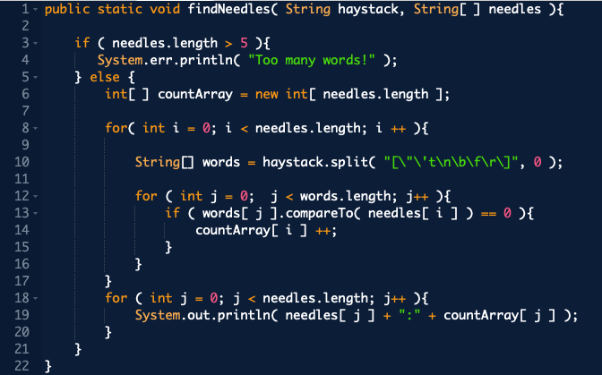

# apiDoc
Create API documentation for calling the following method. Provide some feedback for the java developer. Assume the audience is an experienced java developer.

### Coding Comments / Feedback 
Here's a list of some feedback on your code. 
1. Line 10 creates **words[]** multiple times. It might be ideal to create a string array that contains all the words in **haystack** only once on line 7.  
2. In addition to my first suggestion, you could create a hashmap from **words[]**. Your key, value pair would be of type String, Integer. The String key would be for each unique word represented in **words[]** and the Integer would count every time the word was in **words[]**
